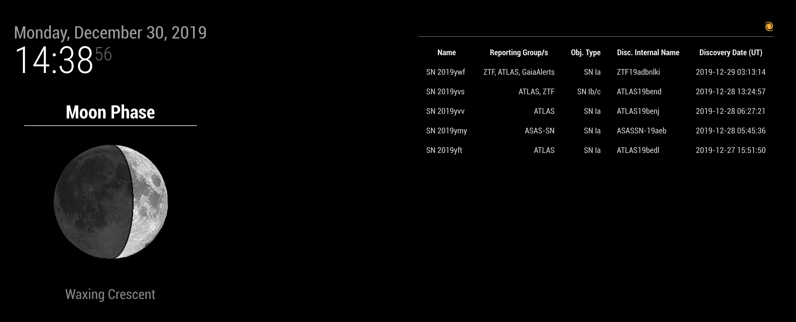

# MMM-tns

MMM-tns is a [MagicMirror](https://magicmirror.builders/) module to display latest new astronomical transients from [TNS](https://wis-tns.weizmann.ac.il/) such as supernova candidates.

## Installation

You need to have [MagicMirror](https://github.com/MichMich/MagicMirror) installed first. Then go to the `modules` folder and clone this repository:

```bash
cd /path/to/MagicMirror/modules
git clone https://github.com/JulienPeloton/MMM-tns.git
```

## Preview

The default preview


Or without the cutouts:



## Configuration

Edit the MagicMirror configuration file (`config/config.js`), and add a new module:

```javascript
{
  module: 'MMM-tns',
  position: 'top_right',
  config: {
      header: "",
      nrows: 5,
      date_start: '2019-12-20',
      classified_sne: '1',
      intervalSeconds: 60 * 60,
      emptyMessage: "No data",
      withImage: true,
      columns: [
          { name: "Name",    title: "Name", cssClass: "left" },
          { name: "Reporting Group/s",    title: "Reporting Group/s", cssClass: "right" },
          { name: "Obj. Type", title: "Obj. Type", cssClass: "right" },
          { name: "Disc. Internal Name",    title: "Disc. Internal Name", cssClass: "left" },
          { name: "Discovery Date (UT)",    title: "Discovery Date (UT)", cssClass: "left" }
      ]
  }
},
```

The different options are

| Name | Type | Comments |
|:--------|:-------|:--------|
| `header` | string | Simple text, or html to display image |
| `nrows` | int | Number of objects to display |
| `date_start` | string | Earliest date to start YYYY-MM-DD |
| `classified_sne` | string | '0' is all candidates, '1' is only confirmed supernova |
| `intervalSeconds` | int | Interval in seconds to rerun the query |
| `emptyMessage` | string | What to display when the query returns no objects |
| `withImage` | bool | Display cutouts or not |
| `columns` | list of dict | Object properties to display (see below) |

The available object properties are: ID, Name, Reps, Class, RA, DEC, Obj. Type, Redshift, Host Name, Host Redshift, Reporting Group/s, Discovery Data Source/s,	Classifying Group/s, Disc. Internal Name, Public, Object Spectra, Discovery Mag, Discovery Mag, Filter, Discovery Date (UT), Sender.
