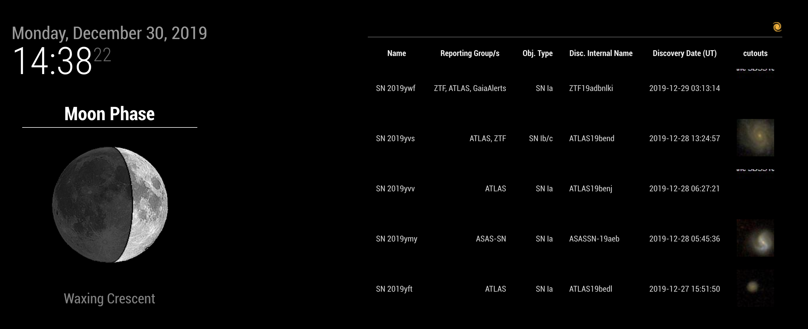

# MMM-tns

MMM-tns is a [MagicMirror](https://magicmirror.builders/) module to display latest new astronomical transients from [TNS](https://wis-tns.weizmann.ac.il/) such as supernova candidates.

## Installation

You need to have MagicMirror installed first. Then go to and clone this repository:

```bash
cd /path/to/MagicMirror/modules
git clone https://github.com/JulienPeloton/MMM-tns.git
```

## Configuration

Edit the MagicMirror configuration file (`config/config.js`), and add a new module:

```javascript
{
  module: 'MMM-tns',
  position: 'top_right',
  config: {
      header: "",
      nrows: 5,
      date_start: '2019-12-20',
      classified_sne: '1',
      intervalSeconds: 60 * 60,
      emptyMessage: "No data",
      withImage: true,
      columns: [
          { name: "Name",    title: "Name", cssClass: "left" },
          { name: "Reporting Group/s",    title: "Reporting Group/s", cssClass: "right" },
          { name: "Obj. Type", title: "Obj. Type", cssClass: "right" },
          { name: "Disc. Internal Name",    title: "Disc. Internal Name", cssClass: "left" },
          { name: "Discovery Date (UT)",    title: "Discovery Date (UT)", cssClass: "left" }
      ]
  }
},
```

## Preview

The default preview


